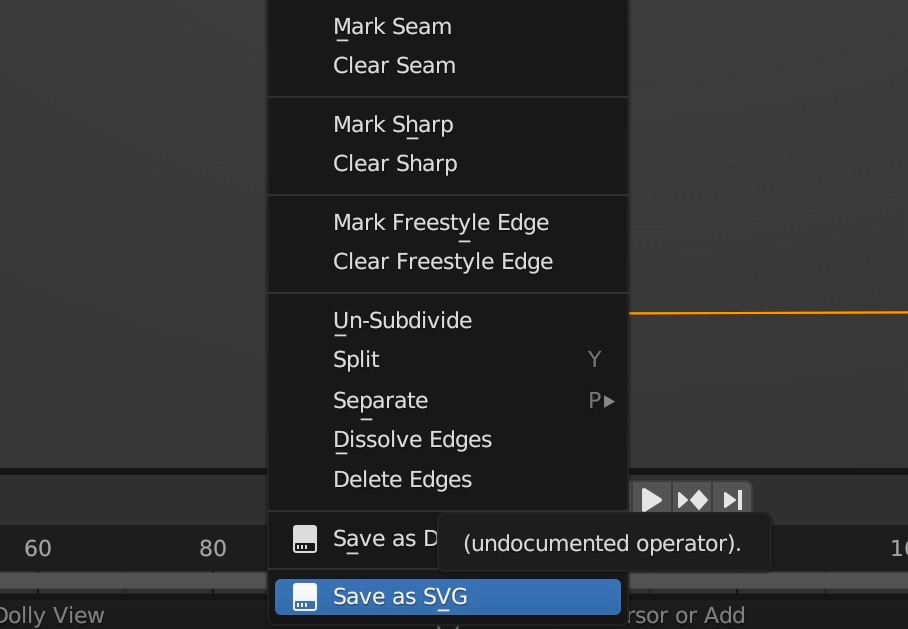

# Blender Save to SVG
A simple add-on for Blender allowing surfaces or selected 2D-objects to be exported as SVG with maintained dimensions. 

It's not meant for a full-blown SVG exporter but as a simple function to save a surface to a SVG-file. The SVG file can then be used by laser cutting or or other tools to do the job. For some, working with Inkscape or Fusion360 is the quickest way to the goal and some picky tools require a known file format to do their job. This is a addon for them.

Naturally, there are some quirks. As it's exporting to regular 2D SVG it will establish the Z coordinate of the first vertex on an object and only export edges and vertices on the same Z level. Selecting the default cube in Blender will therefore render only the square at the bottom of the cube, according to the global orientation. 

**Heads up:** Transforms will be automatically applied when running the stub. Mostly a convenience as the author of the plugin intermittently forgot to apply before exports. 

The Blender file must be saved before export. Once the file is saved the expored .dxf will end up in the same folder, with the same name but a .svg extentions instead of .blend. No questions are asked, so other .svg files with the same name can be accidently overwritten.

# Requirements
If you're auditious enough to build a zip-file yourself this addon require:

``` svgwrite ```

# Install
Go to [latest release](https://github.com/Mikrofabriken/blender-save-to-svg/releases/latest) and download the addon zip-file. Go to Edit/Preferences/Add-ons in Blender and click the install button, select the downloaded zip-file and install. Check the box on "Save_as_dxf" and you should be done. All required dependencies will be automatically installed.

# In object mode
Select all objects you want to export, right click and select "Save as SVG". 


# In edit mode
Select the face you want to export, right click and select "Save as SVG"


